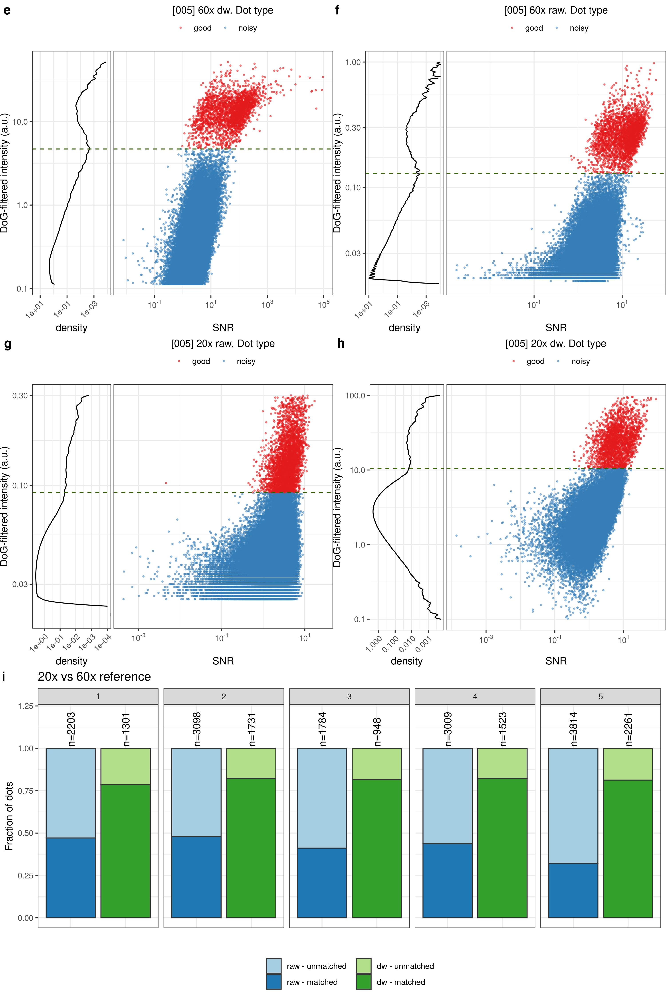
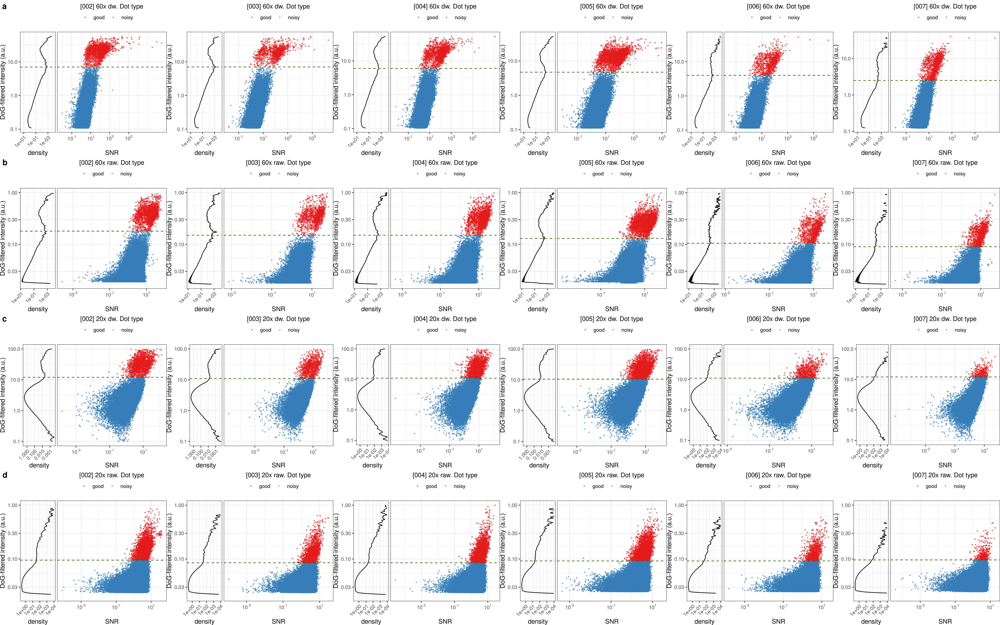
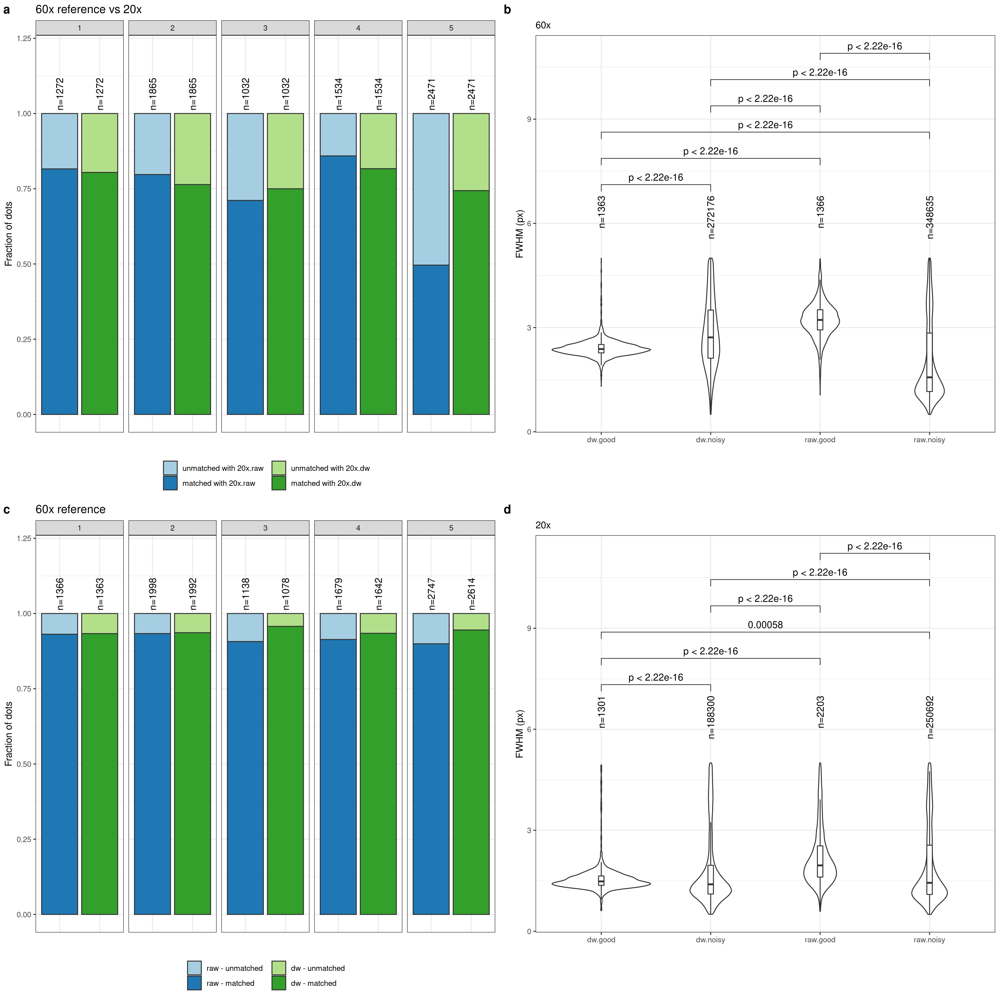

## Ki67 tissue smFISH

Draft text: [here](https://docs.google.com/document/d/1ynNk3r_2EZ8Ckp6chrSjGuqsaPwaHwm1uFVu63Jpbcc/edit)

## Figures

### Figure 3

- [x] Panel e: scatterplot of Value (Y) and SNR (X) for 60x.dw, field 5. Density of Value on the side of Y panel.
- [x] Panel f: scatterplot of Value (Y) and SNR (X) for 60x.raw, field 5. Density of Value on the side of Y panel.
- [x] Panel g: scatterplot of Value (Y) and SNR (X) for 20x.raw, field 5. Density of Value on the side of Y panel.
- [x] Panel h: scatterplot of Value (Y) and SNR (X) for 20x.dw, field 5. Density of Value on the side of Y panel.
- [x] Panel i: column-plot with matched dot between 20x.raw/dw and 60x-based reference, by field.

### Supplementary Figure X1

- [x] Panel a: scatterplot of Value (Y) and SNR (X) for 60x.dw, fields 1-4. Density of Value on the side of Y panel.
- [x] Panel b: scatterplot of Value (Y) and SNR (X) for 60x.raw, fields 1-4. Density of Value on the side of Y panel.
- [x] Panel c: scatterplot of Value (Y) and SNR (X) for 20x.raw, fields 1-4. Density of Value on the side of Y panel.
- [x] Panel d: scatterplot of Value (Y) and SNR (X) for 20x.dw, fields 1-4. Density of Value on the side of Y panel.

### Supplementary Figure X2

- [x] Panel a: FWHM distribution of dots un/filtered by field-based threshold for 60x DW and raw, field 5.
- [x] Panel b: column-plot with dot overlap between 60x raw and DW, by field.
- [x] Panel c: column-plot with unmatched dot between 20x.raw/dw and 60x-based reference, by field.
- [x] Panel d: FWHM distribution of dots un/filtered by field-based threshold for 20x DW and raw, field 5.

### Supplementary Figure X3

- [x] Panel a: scatterplot of Value (Y) and SNR (X) for 20x.raw, cleaned, field 5. Density of Value on the side of Y panel.
- [x] Panel b: FWHM distribution of dots un/filtered by field-based threshold for 20x raw, clean, field 5.
- [x] Panel c: column-plot with matched dot between 20x.raw/clean and 60x-based reference, by field.
- [x] Panel d: column-plot with unmatched dot between 20x.raw/clean and 60x-based reference, by field.
