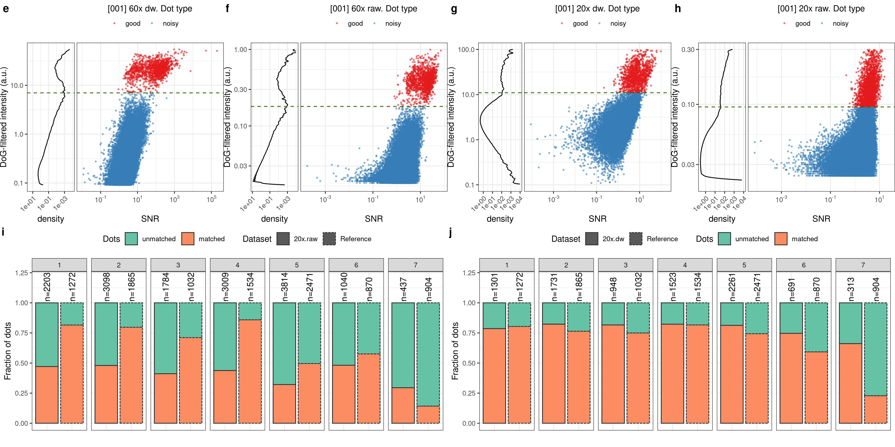
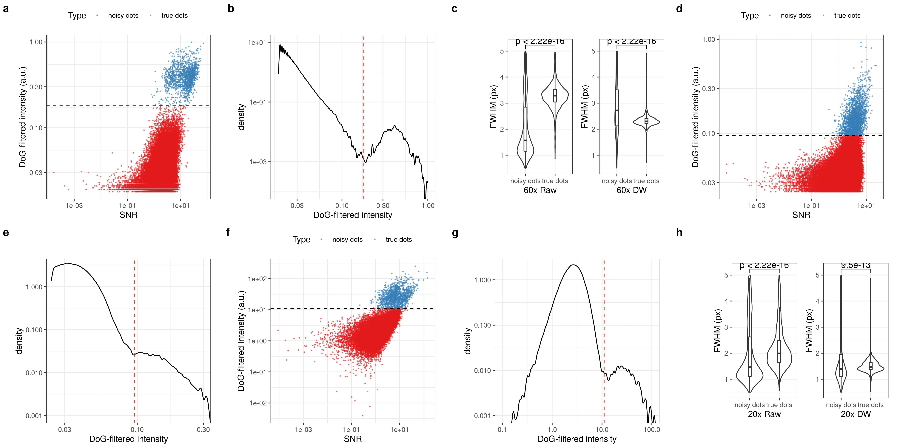

## Ki67 tissue smFISH

Draft text: [here](https://docs.google.com/document/d/1ynNk3r_2EZ8Ckp6chrSjGuqsaPwaHwm1uFVu63Jpbcc/edit)

## Figure

- **Figure 3**.
    + [ ] Panel e: scatterplot of Value (Y) and SNR (X) for 60x.dw, field 1. Density of Value on the side of Y panel.
    + [ ] Panel f: scatterplot of Value (Y) and SNR (X) for 60x.dw, field 1. Density of Value on the side of Y panel.
    + [ ] Panel g: scatterplot of Value (Y) and SNR (X) for 60x.dw, field 1. Density of Value on the side of Y panel.
    + [ ] Panel h: scatterplot of Value (Y) and SNR (X) for 60x.dw, field 1. Density of Value on the side of Y panel.
    + [ ] Panel i: column-plot with dot overlap between 20x.raw and 60x-based reference, by field.
    + [ ] Panel j: column-plot with dot overlap between 20x.dw and 60x-based reference, by field.

- **Supplementary X1**.
    + [ ] Panel a: scatterplot of Value (Y) and SNR (X) for 60x.dw, fields 2-7. Density of Value on the side of Y panel.
    + [ ] Panel b: scatterplot of Value (Y) and SNR (X) for 60x.raw, fields 2-7. Density of Value on the side of Y panel.
    + [ ] Panel c: scatterplot of Value (Y) and SNR (X) for 20x.dw, fields 2-7. Density of Value on the side of Y panel.
    + [ ] Panel d: scatterplot of Value (Y) and SNR (X) for 20x.raw, fields 2-7. Density of Value on the side of Y panel.

- **Supplementary X2**.
    + [ ] Panel a: column-plot with dot overlap between 60x raw and DW, by field.
    + [ ] Panel b: FWHM distribution of dots un/filtered by field-based threshold for 60x DW and raw, all fields.
    + [ ] Panel c: FWHM distribution of dots un/filtered by field-based threshold for 20x DW and raw, all fields.

### Old panels:

- [x] Panel: inset of 60x raw with DAPI in blue, FISH dots in magenta, nuclear contour in yellow.
- [x] Panel: inset of 60x DW with DAPI in blue, FISH dots in magenta, nuclear contour in yellow.
- [x] Panel: inset of 20x raw with DAPI in blue, FISH dots in magenta, nuclear contour in yellow.
- [x] Panel: inset of 20x DW with DAPI in blue, FISH dots in magenta, nuclear contour in yellow.
- [x] Panel: scatterplot of DoG-filtered intensity (Y) vs SNR (X), for 60x raw field #1.
- [x] Panel: logged density distribution for threshold identification, in 60x raw field #1.
- [x] Panel: scatterplot of DoG-filtered intensity (Y) vs SNR (X), for 20x raw field #1.
- [x] Panel: logged density distribution for threshold identification, in 20x raw field #1.
- [x] Panel: scatterplot of DoG-filtered intensity (Y) vs SNR (X), for 20x DW field #1.
- [x] Panel: logged density distribution for threshold identification, in 20x DW field #1.
- [x] Panel: FWHM distribution of dots un/filtered by field-based threshold for 60x DW and raw, field #1.
- [x] Panel: FWHM distribution of dots un/filtered by field-based threshold for 20x DW and raw, field #1.